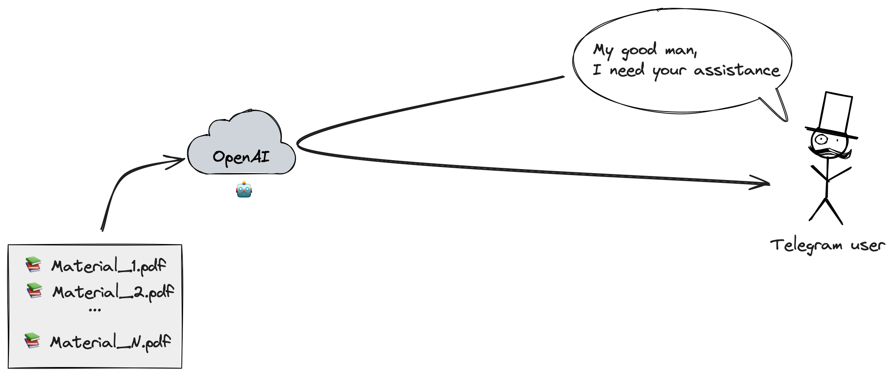

# Partner: A Telegram Bot with ChatGPT Integration

## Overview

Partner is a Telegram bot that integrates with OpenAI's ChatGPT Assistant to provide an intelligent assistant within your Telegram chats. This bot leverages the power of ChatGPT to understand and respond to user queries in a conversational manner.



## Features

- **Natural Language Processing**: Uses ChatGPT to understand and respond to queries.
- **Dockerized**: The bot is packaged as a Docker container for easy deployment.

## Getting Started

### Prerequisites

- Docker
- Telegram account and bot token
- OpenAI API key and assistant ID

### Setup

1. **Clone the repository**:

    ```sh
    git clone https://github.com/smirnoffmg/partner.git
    cd partner
    ```

2. **Create a `.env` file** with the following content:

    ```env
    PRTNR_AUTHOR="@not_again_please"
    PRTNR_DEBUG=1
    PRTNR_TELEGRAM_BOT_TOKEN=
    PRTNR_OPENAI_API_KEY=
    PRTNR_OPENAI_ASSISTANT_ID=
    PRTNR_DB_DSN="host=db user=postgres password=postgres dbname=postgres"

    # payments
    PRTNR_FREE_MESSAGES_COUNT=50
    PRTNR_PAYMENT_DESCRIPTION="Some description about how cool your bot is (50 messages)"
    PRTNR_PAYMENT_TOKEN=
    PRTNR_PRICE_PER_MSG_PACK=99000
    PRTNR_PRICE_CURRENCY=EUR
    PRTNR_MSG_PACK=50

    TZ=Asia/Yerevan

    POSTGRES_USER=postgres
    POSTGRES_PASSWORD=postgres

    SENTRY_DSN=

    ```

3. **Run docker-compose**:

    ```sh
    docker-compose up --build
    ```

## Usage

Once the bot is running, you can start a chat with it on Telegram. The bot will respond to your messages using ChatGPT.

## License

This project is licensed under the MIT License. See the [LICENSE](LICENSE) file for details.

## Contact

If you have any questions or suggestions, feel free to open an issue or reach out to the repository owner.
Or you can contact me directly at [@not_again_please](https://t.me/not_again_please).

---

Happy chatting with your new intelligent assistant!
